## 🕵️ Agent Dossier

| Field | Details |
|:---|:---|
| **Occupation** | Backend Developer. I investigate scalable systems — tracking down performance bottlenecks, interrogating broken APIs, and piecing together distributed architectures one clue at a time. |
| **Current Case** | Java-based applications & scalable Spring Boot backend systems. The investigation is ongoing. |
| **Under Study** | Cybersecurity · Advanced Machine Learning · Cloud Computing — every good detective expands their methods. |
| **Specialisms** | Java · Spring Boot · Backend Dev · Machine Learning · System Design |
| **Known For** | Building real-world projects, collaborating with curious minds, and contributing to open-source investigations that matter. |
| **Reach Me** | mercia.jeno@gmail.com |

## 🔬 Evidence — Languages
> *Exhibit A: Primary tongues spoken in the field*

  
  
  
  

## 🧪 The Arsenal — Tools & Frameworks
> *Exhibit B: Instruments of investigation*

  
  
  
  
  
  
  

## ⚙️ Field Kit — DevOps & Platforms
> *Exhibit C: Operative's field equipment*

  
  
  
  
  

## 📁 Case Files — GitHub Activity

  

> *The evidence doesn't lie. Every commit is a clue.*

  

  

*"The game is afoot."* — S. Holmes

